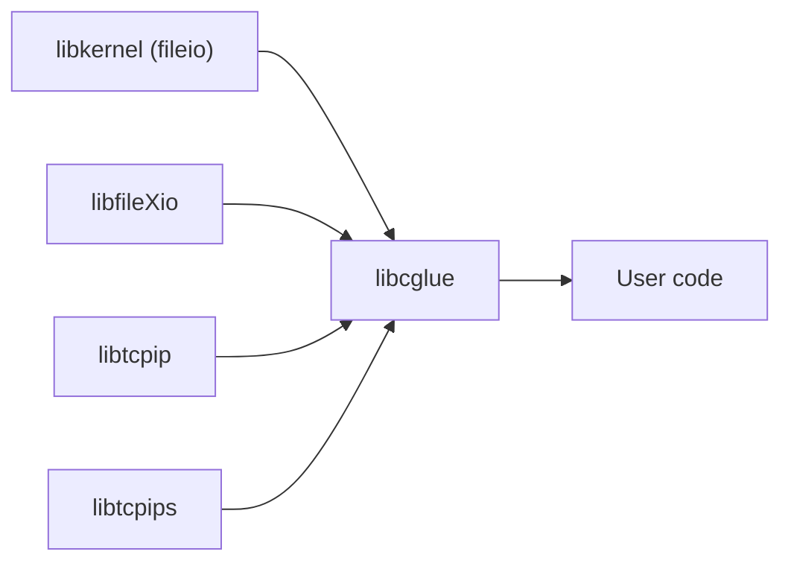

# libcglue

This library provides functions to bridge the gap between newlib and libraries provided by ps2sdk.  

## About file descriptors

ps2sdk uses multiple libraries to interact with files and sockets.  
libcglue fdman unifies the file descriptors provided by these libraries into a single namespace:  

